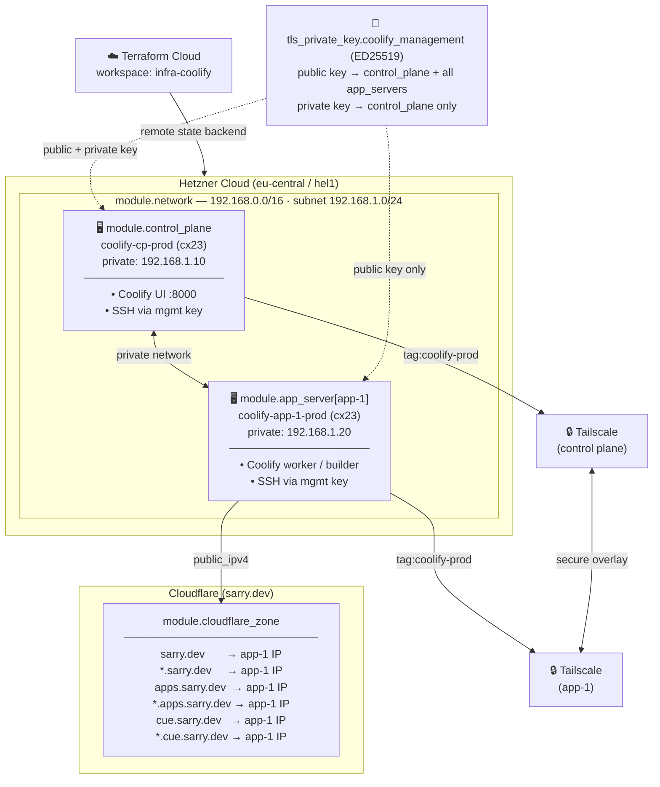

# coolify-prod

Production Terraform root module that wires together all child modules to deploy a self-hosted [Coolify](https://coolify.io) cluster on Hetzner Cloud, secured via Tailscale and fronted by Cloudflare DNS.

---

## Architecture

> 📐 An [Excalidraw](https://excalidraw.com) version of this diagram is available at [`architecture.excalidraw`](./architecture.excalidraw) — open it via **File → Open** in Excalidraw.



---


## Module Dependencies

```
coolify-prod (root)
│
├── tls_private_key.coolify_management
│       └─► used by: module.control_plane (public + private key)
│           used by: module.app_server    (public key only)
│
├── tailscale_tailnet_key.control_plane
│       └─► used by: module.control_plane (tailscale_auth_key)
│
├── tailscale_tailnet_key.app_server[*]
│       └─► used by: module.app_server[*] (tailscale_auth_key)
│
├── module.network  ──────────────────────────────────────────────────────┐
│   source: ../modules/network                                            │
│   outputs: network_id, subnet_ip_range                                  │
│       └─► network_id used by: module.control_plane, module.app_server  │
│                                                                         │
├── module.control_plane  ────────────────────────────────────────────────┤
│   source: ../modules/control-plane                                      │
│   depends on: module.network, tls_private_key, tailscale_tailnet_key   │
│   outputs: id, public_ipv4, private_ipv4, tailscale_hostname            │
│                                                                         │
├── module.app_server[*]  ────────────────────────────────────────────────┤
│   source: ../modules/app-server                                         │
│   depends on: module.network, tls_private_key, tailscale_tailnet_key   │
│   outputs: id, public_ipv4, private_ipv4, tailscale_hostname            │
│                                                                         │
└── module.cloudflare_zone  ──────────────────────────────────────────────┘
    source: ../modules/cloudflare-zone
    depends on: module.app_server[var.primary_app_server_key].public_ipv4
    manages: A records for @ (root), * (root wildcard),
             app_subdomain, *.app_subdomain, cue, *.cue
```

---

## Providers

| Provider | Version | Purpose |
|---|---|---|
| `hetznercloud/hcloud` | `~> 1.60` | Servers, networks, volumes |
| `cloudflare/cloudflare` | `~> 5.0` | DNS records |
| `tailscale/tailscale` | `~> 0.17` | Tailnet auth keys |
| `hashicorp/tls` | `~> 4.0` | ED25519 management key-pair |

---

## Variables

| Name | Default | Description |
|---|---|---|
| `instance_name` | `prod` | Short name embedded in all resource names |
| `base_domain` | `sarry.dev` | Cloudflare-managed apex domain |
| `app_subdomain` | `apps` | Primary apps subdomain |
| `location` | `hel1` | Hetzner datacenter |
| `image` | `ubuntu-24.04` | Hetzner OS image |
| `app_servers` | `{app-1: cx23/192.168.1.20}` | Map of app server configs |
| `primary_app_server_key` | `app-1` | App server used as DNS origin |
| `operator_ssh_public_keys` | `[]` | Break-glass SSH keys |
| `tailscale_tag` | `tag:coolify-prod` | ACL tag for bootstrap keys |
| `tailscale_tailnet` | — | Tailnet identifier (required) |
| `tailscale_oauth_client_id` | — | OAuth client ID (sensitive, required) |
| `tailscale_oauth_client_secret` | — | OAuth client secret (sensitive, required) |

---

## Outputs

| Name | Description |
|---|---|
| `coolify_ui` | Tailscale URL for the Coolify dashboard |
| `control_plane` | Hetzner ID, public/private IPv4, Tailscale hostname |
| `app_servers` | Same details keyed by app_servers map key |
| `app_base_fqdn` | `apps.sarry.dev` |
| `app_wildcard_fqdn` | `*.apps.sarry.dev` |
| `primary_origin_ipv4` | Public IPv4 currently receiving DNS traffic |
| `coolify_management_ssh_private_key` | *(sensitive)* Private key to paste into Coolify UI |

---

## Usage

```bash
# Copy and populate secrets
cp terraform.tfvars.example terraform.tfvars

# Initialise (uses Terraform Cloud remote backend)
terraform init

# Preview changes
terraform plan

# Apply
terraform apply
```


